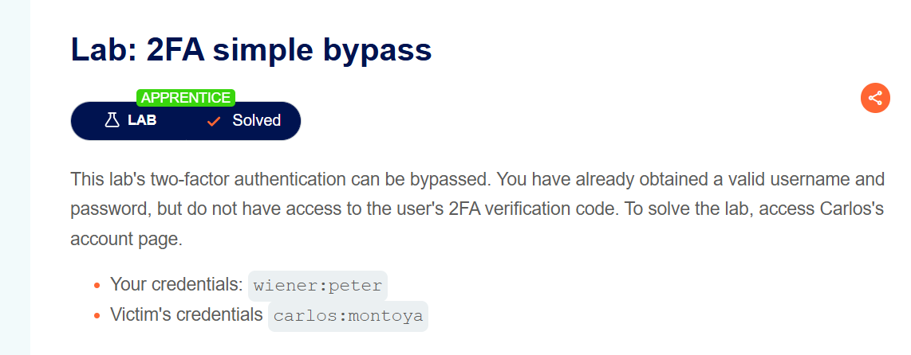

# Lab: 2FA Simple Bypass

**Difficulty:** `APPRENTICE`  
**Platform:** PortSwigger Web Security Academy  
**Category:** Authentication — Multi-Factor Authentication Bypass

---

## Objective

This lab's two-factor authentication can be bypassed. You have already obtained a valid username and password, but do not have access to the user's 2FA verification code. To solve the lab, access Carlos's account page.

| Credential | Value |
|---|---|
| Your credentials | `wiener:peter` |
| Victim's credentials | `carlos:montoya` |

---

## Vulnerability Explanation

The 2FA implementation has a critical logic flaw: after a user successfully authenticates with their username and password, the application transitions them into a "pending 2FA" state. However, **the session is already partially authenticated at this point**. The `/my-account` route does not verify whether the 2FA step was actually completed — it only checks that the first factor was passed. By manually navigating to `/my-account` while in this pending state, an attacker can skip the 2FA prompt entirely and land directly on the authenticated account page.

---

## Tools Required

- A web browser (no Burp Suite needed for this lab)

---

## Step-by-Step Solution

### Step 1 — Understand the Lab & Log In With Your Own Account First

Open the lab and familiarise yourself with the flow. Log in with your own credentials (`wiener:peter`) first. After login, you'll be prompted for a 2FA code — click the **Email client** button to retrieve it. Then navigate to `/my-account` and **note the URL structure**.

> 💡 The URL pattern you want to remember is: `https://<lab-id>.web-security-academy.net/my-account`

Log out of your account after taking note of the URL.

---

### Step 2 — Log In With the Victim's Credentials

Navigate back to the login page and enter the victim's credentials: `carlos` / `montoya`.


> The lab status bar shows **"Not solved"** at this point. Carlos's password is accepted and the first authentication factor passes successfully.

---

### Step 3 — The 2FA Prompt Appears

After the credentials are accepted, the application redirects to the 2FA verification page, prompting for a 4-digit security code.


> We do not have access to Carlos's 2FA code. **Do not attempt to submit anything here.**

---

### Step 4 — Bypass 2FA by Manually Changing the URL

While on the 2FA prompt page, click into the browser's address bar and **manually change the URL** to navigate directly to `/my-account`, like so:

```
https://<your-lab-id>.web-security-academy.net/my-account
```


> The address bar shows the `/my-account` URL being typed directly. The server accepts this request because the session already holds a valid first-factor authentication token — it never checks whether 2FA was completed.

---

### Step 5 — Lab Solved: Carlos's Account Page Loads

Press Enter. The application loads Carlos's **My Account** page directly, bypassing the 2FA requirement entirely. The lab banner changes to **"Solved"**.


> The page confirms: **"Your username is: carlos"** and **"Your email is: carlos@carlos-montoya.net"**. The orange **"Congratulations, you solved the lab!"** banner confirms completion.

---

### Step 6 — Lab Confirmed Solved

The lab description page also reflects the solved status.



---

## Key Takeaway

The flaw here is that the application **trusts the session state from the first factor** without enforcing that the second factor was completed before granting access to protected resources. A properly implemented 2FA system should:

1. Keep the session in an **unauthenticated state** until both factors are verified.
2. Validate on every protected route that the full 2FA flow was completed.
3. Redirect to the 2FA page — not serve the account page — if 2FA is pending.

---

## Remediation

- Do not grant any session privileges after the first factor alone.
- Store a separate flag (e.g., `mfa_verified: true`) in the session, and check it on every authenticated endpoint.
- Redirect users who attempt to access protected routes mid-MFA back to the 2FA verification step.

---

*PortSwigger Web Security Academy — Authentication Labs*
