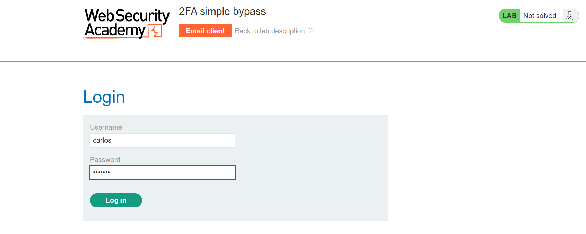
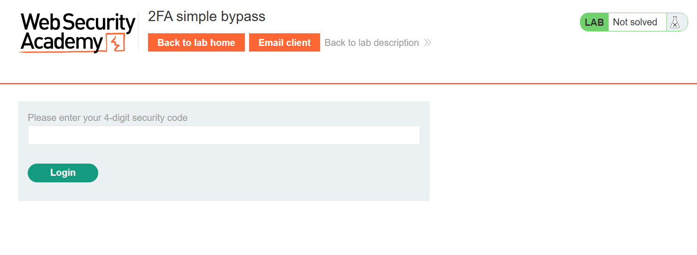
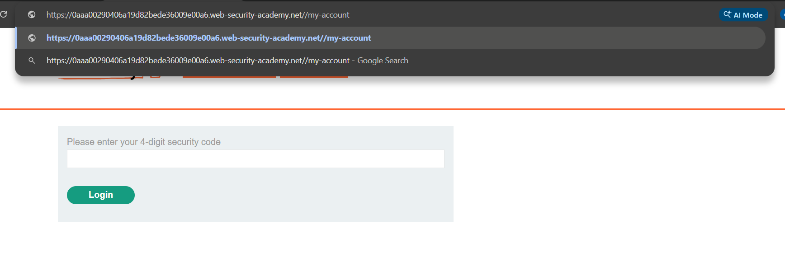
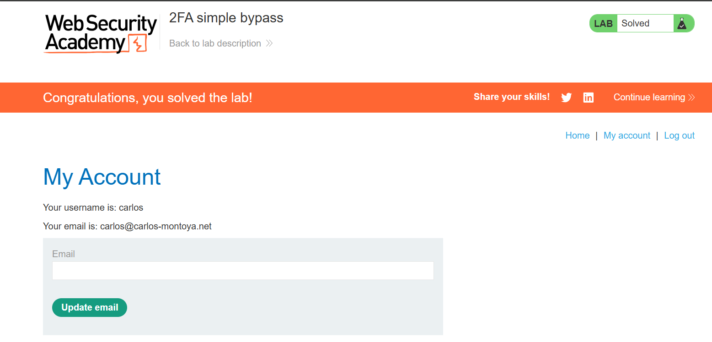

# Lab Writeup: 2FA Simple Bypass

> **Platform:** PortSwigger Web Security Academy  
> **Category:** Authentication  
> **Difficulty:** Apprentice  
> **Status:** ✅ Solved  
> **Date:** April 2026  

---

## Overview

This lab demonstrates a 2FA (Two-Factor Authentication) bypass vulnerability where the application fails to properly enforce the second authentication step. After completing the first factor (username/password), the application navigates to the 2FA page — but the user's logged-in state is already established, meaning the 2FA page can simply be skipped by navigating directly to an authenticated URL.

**Objective:** Bypass 2FA and access Carlos's account page without completing the 2FA step.



---

## Vulnerability Description

| Attribute | Detail |
|-----------|--------|
| **Vulnerability Type** | 2FA Bypass — Forced Browsing / Logic Flaw |
| **OWASP Category** | A07:2021 – Identification and Authentication Failures |
| **Root Cause** | Session is marked as authenticated after step 1; 2FA step is not enforced server-side |
| **Impact** | Full account takeover — bypasses 2FA entirely |
| **Credentials Required** | Yes — carlos:montoya (provided by lab) |

---

## Tools Used

- **Browser** – URL manipulation to skip the 2FA page

---

## Exploitation Steps

### Step 1 — Log In as Carlos (Step 1 of Authentication)

Use the provided credentials for the victim account:
- **Username:** `carlos`
- **Password:** `montoya`

Submit the login form.


---

### Step 2 — 2FA Prompt Appears

After entering valid credentials, the application redirects to the 2FA page prompting for a 4-digit security code. The code would normally be sent to Carlos's email.

This is the page that needs to be **bypassed entirely**.



---

### Step 3 — Skip the 2FA Page via URL Manipulation

Instead of entering a code, manually navigate directly to the authenticated account page by typing in the URL bar:

```
/my-account
```

The application does not verify whether the 2FA step was completed — it already considers the session authenticated after the first factor. The `/my-account` page loads successfully.



---

### Step 4 — Lab Solved — Full Account Access

Carlos's account page is displayed and the lab is marked as solved, confirming that 2FA was completely bypassed.



---

## Root Cause Analysis

```
Normal 2FA Flow:
  Step 1: POST /login (username + password) → session created BUT flagged as "pending 2FA"
  Step 2: POST /login2 (2FA code)           → session upgraded to "fully authenticated"

Vulnerable Flow:
  Step 1: POST /login (username + password) → session created AND immediately "fully authenticated"
  Step 2: GET /my-account                   → session is valid, page loads ✓ (2FA never checked)
```

The server establishes a fully authenticated session after the first factor. The 2FA page is purely a front-end step — the server never enforces it before granting access to authenticated pages.

---

## Remediation

| Recommendation | Description |
|----------------|-------------|
| **Enforce 2FA server-side** | The session must be flagged as "pending 2FA" after step 1 and only upgraded to fully authenticated after successful code verification |
| **Block access to authenticated pages during pending 2FA** | Any request to `/my-account` or similar should redirect to the 2FA page if the session is still pending |
| **Invalidate session on 2FA timeout** | If the 2FA code is not entered within a time window, destroy the session |
| **Use a dedicated 2FA state flag** | Store `mfa_verified: false` in the session after step 1; only set `true` after step 2 succeeds |

---

## Key Takeaways

- **2FA is only as strong as its enforcement.** Adding a 2FA page without enforcing it server-side provides zero additional security.
- **Forced browsing** — directly navigating to URLs — is a powerful technique for bypassing front-end-only controls.
- **Session state must track 2FA completion.** A session should have a `pending_mfa` flag that blocks access to authenticated resources until the second factor is verified.
- This is classified as a **logic flaw** — the vulnerability is not in the 2FA mechanism itself but in how the authentication flow is managed.

---

*Writeup produced as part of PortSwigger Web Security Academy lab practice.*
