# Lab: Broken Brute-Force Protection, IP Block

**Difficulty:** `PRACTITIONER`  
**Platform:** PortSwigger Web Security Academy  
**Category:** Authentication — Brute-Force Protection Bypass

---

## Objective

This lab is vulnerable due to a logic flaw in its password brute-force protection. To solve the lab, brute-force the victim's password, then log in and access their account page.

| Credential | Value |
|---|---|
| Your credentials | `wiener:peter` |
| Victim's username | `carlos` |
| Passwords | Candidate password list (from lab) |

🧠 Attacker’s Approach

While testing the login functionality, I noticed that after a few incorrect attempts, the application temporarily blocked further login requests from my IP.However, after logging in with valid credentials, the block was reset. This indicated that the application resets the failed login counter on successful authentication.This behavior suggested that the brute-force protection could be bypassed by mixing valid login attempts with invalid ones.


## Vulnerability Explanation

The application blocks an IP address after **3 consecutive failed login attempts**. However, the counter for failed attempts is **reset whenever a successful login occurs** — regardless of the account used. This means an attacker can interleave their own successful logins between brute-force attempts against the victim's account, effectively preventing the lockout counter from ever reaching the threshold.

By alternating login attempts — `wiener` (success) → `carlos` (attempt) → `wiener` (success) → `carlos` (attempt) — the counter resets after every `wiener` login, and the IP is never blocked.

---

## Tools Required

- **Burp Suite** (Community Edition is sufficient)
- Candidate password list (provided by the lab)

---

## Step-by-Step Solution

### Step 1 — Understand the Lab & Explore the Login Page

Read the lab description and confirm the credentials. The lab is marked **PRACTITIONER** difficulty and shows as **Solved** upon completion.

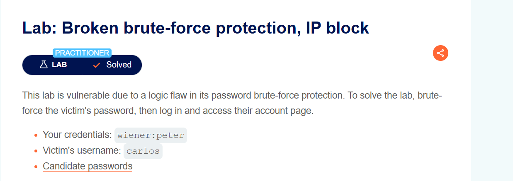

---

### Step 2 — Observe the IP Blocking Behaviour

With Burp running, submit invalid credentials on the login page to confirm the brute-force protection. After **3 incorrect logins in a row**, the server returns an "Invalid username" error. Submitting a 4th wrong attempt will trigger an IP block.

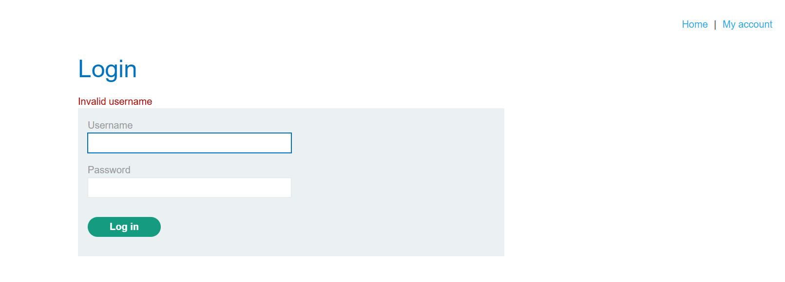

> Key observation: logging in with your **own valid credentials** (`wiener:peter`) resets the failed attempt counter. This is the logic flaw we exploit.

---

### Step 3 — Capture the POST /login Request in Burp Proxy

Submit any login attempt with Burp running. In **Proxy → HTTP history**, locate the `POST /login` request. Right-click it and select **Send to Intruder**.

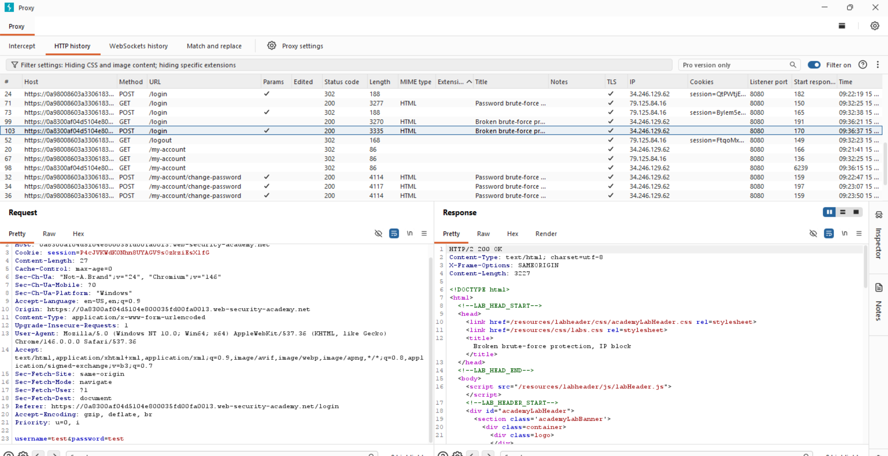

> In Burp's HTTP history, you can see both `POST /login` requests (returning 302 for success and 200 for failure) alongside `/my-account` and other requests. The highlighted row is the `POST /login` request being targeted.

---

### Step 4 — Configure Intruder: Pitchfork Attack + Resource Pool

In **Burp Intruder**, set the attack type to **Pitchfork** and add payload markers (`§`) around both the `username` and `password` parameters. Then open the **Resource pool** panel and create a new resource pool with **Maximum concurrent requests set to `1`**.

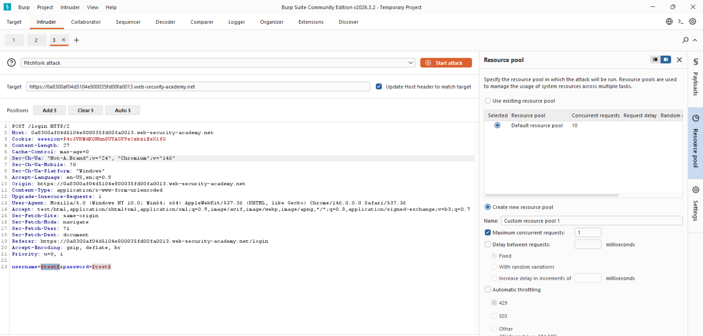

> Setting concurrency to `1` is critical — it ensures requests are sent **sequentially in the exact order you define**, so `wiener` always fires before `carlos` in each pair. If requests run in parallel, the counter-reset trick breaks down.

---

### Step 5 — Set Payload Position 2: The Password List

Click **Payloads** and select **Position 2** from the payload position drop-down. Enter the password list, inserting your own password (`peter`) before each candidate password from the list.

The pattern should look like:
```
peter
123456
peter
password
peter
12345678
peter
qwerty
...
```

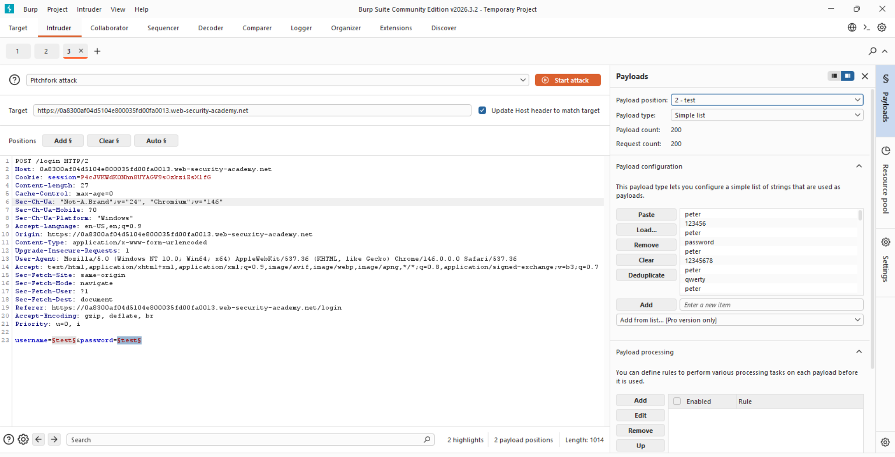

> `peter` aligns with every `wiener` entry in the username list (ensuring those are successful logins that reset the counter). Each candidate password aligns with `carlos`.

---

### Step 6 — Attack Begins: Observe the Alternating Pattern

Start the attack. The results panel shows pairs of requests — `wiener` with 302 (redirect = success) immediately followed by `carlos` with 200 (failure = wrong password). This confirms the counter-reset strategy is working.

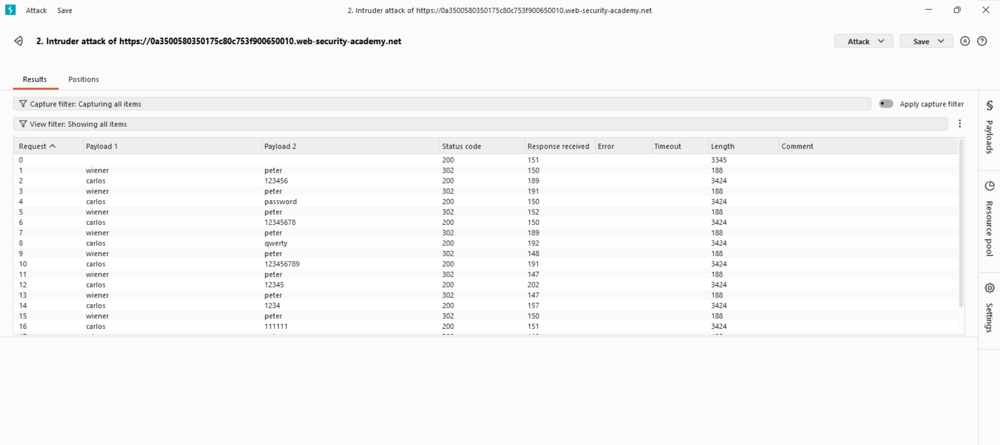

> Notice the alternating Payload 1 / Payload 2 pattern: wiener/peter → carlos/123456 → wiener/peter → carlos/password. The `wiener` entries consistently return **302**, keeping the IP block counter from accumulating.

---

### Step 7 — Confirm the Resource Pool is Enforcing Sequential Execution

The Intruder configuration shows the **Custom resource pool 1** selected with **1 concurrent request**, ensuring strict ordering is maintained throughout the attack.

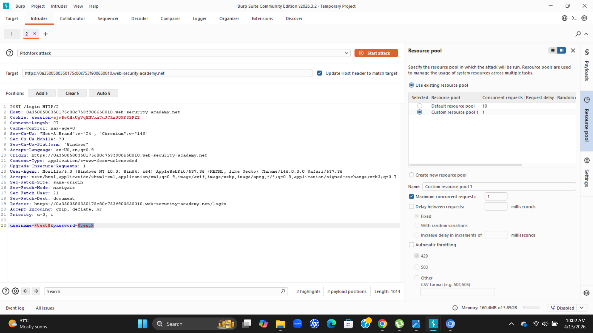

---

### Step 8 — Configure Payload Position 1: The Username List

Select **Position 1** from the payload position drop-down. Add the alternating username list — starting with `wiener`, then `carlos`, repeating. Ensure `carlos` appears at least 100 times (once per candidate password).

```
wiener
carlos
wiener
carlos
wiener
carlos
...
```

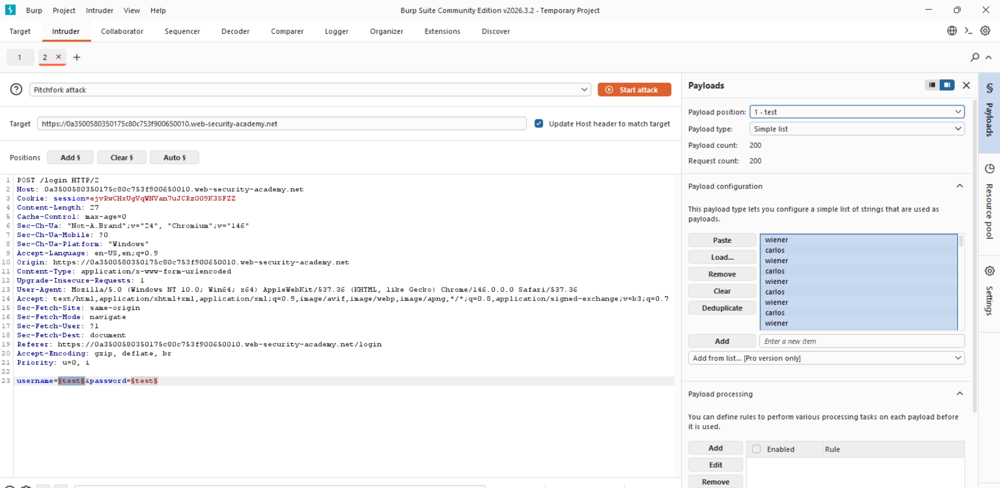

> The `wiener` entries at odd positions pair with `peter` in the password list (guaranteed successful logins). The `carlos` entries at even positions pair with each candidate password being tested.

---

### Step 9 — Identify the Successful Response for Carlos

When the attack finishes, scroll through the results. Filter out 200 responses or sort by status code. Look for the **single 302 response where Payload 1 is `carlos`** — this is the successful login. Note the password from the Payload 2 column.

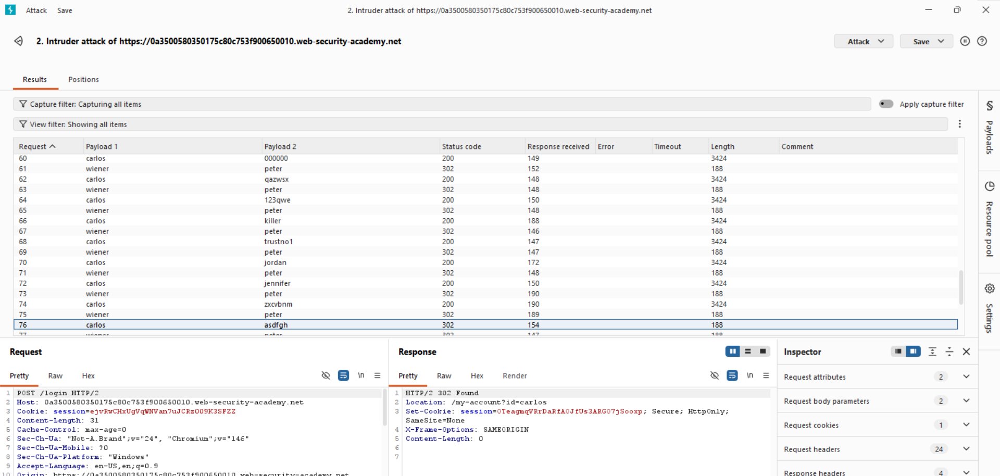

> Row 76 shows `carlos` with password `asdfgh` returning a **302** redirect (to `/my-account`), confirming this is the correct password. The response body confirms `Location: /my-account?id=carlos`.

---

### Step 10 — Log In as Carlos with the Discovered Password

In the browser, navigate to the login page and enter `carlos` as the username and the discovered password.

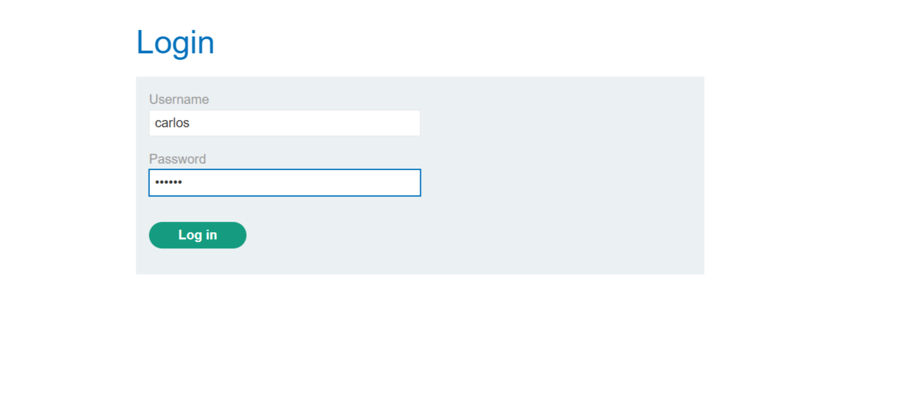

---

### Step 11 — Lab Solved: Carlos's Account Page

The application logs you in as Carlos and the **"Congratulations, you solved the lab!"** banner appears. Carlos's **My Account** page is now accessible.

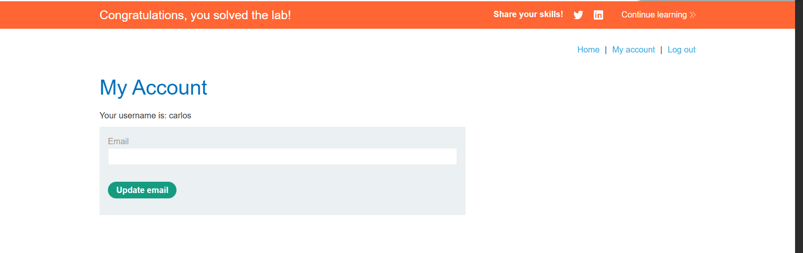

---

## Key Takeaway

The brute-force protection fails because the **IP-based counter is tied to login failures, not to the account being attacked**. Resetting the counter by logging into a different (known-valid) account is a classic bypass of stateless IP-based rate limiting.

Proper defences should:
1. Use **account-level lockout** (per-username), not just IP-based lockout.
2. Implement **CAPTCHA** after a threshold of failures.
3. Apply **exponential backoff** that cannot be reset by logging into another account.
4. Use IP reputation and anomaly detection independent of the success/failure counter.

---

## Remediation

- Rate-limit login attempts **per username**, not just per IP.
- Do not reset the failed-attempts counter on successful login from a different account on the same IP.
- Consider multi-factor authentication for all accounts to render password brute-force ineffective.

🌍 Real-World Scenario

In real applications, weak brute-force protection like this can allow attackers to systematically guess passwords and take over user accounts, especially when no additional protections (like MFA) are in place.

🏁 Conclusion

This lab shows how improper implementation of brute-force protection can make security controls ineffective. By exploiting a logic flaw in how failed attempts are tracked, it was possible to bypass the IP block and successfully brute-force a user’s password.

*PortSwigger Web Security Academy — Authentication Labs*
