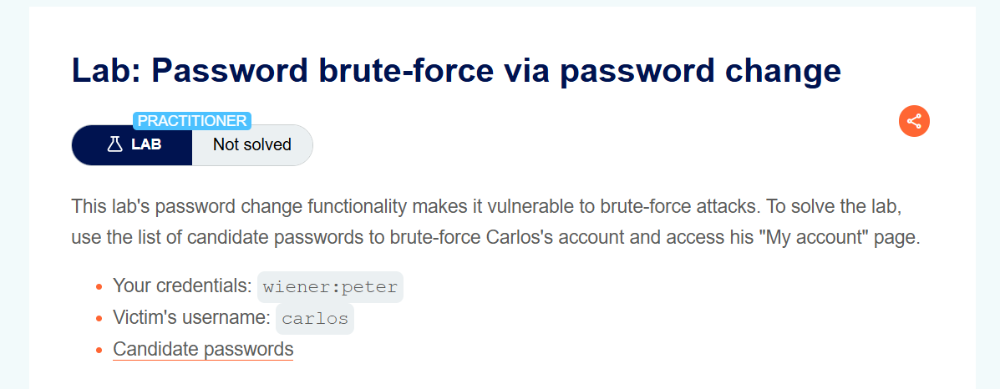
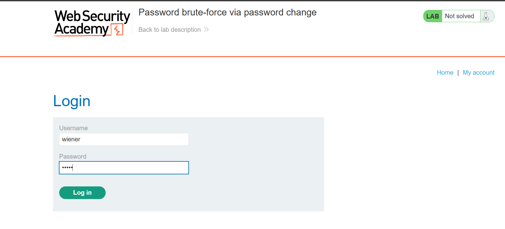
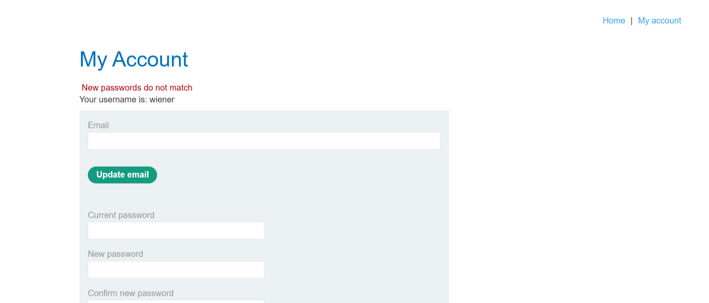
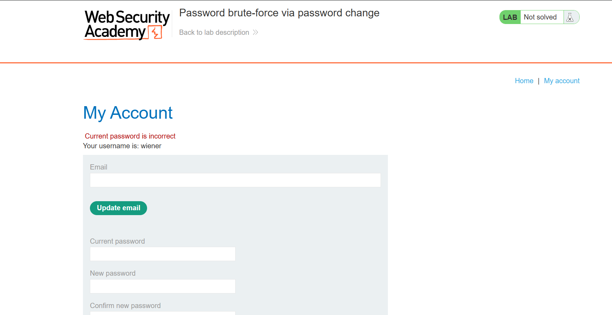
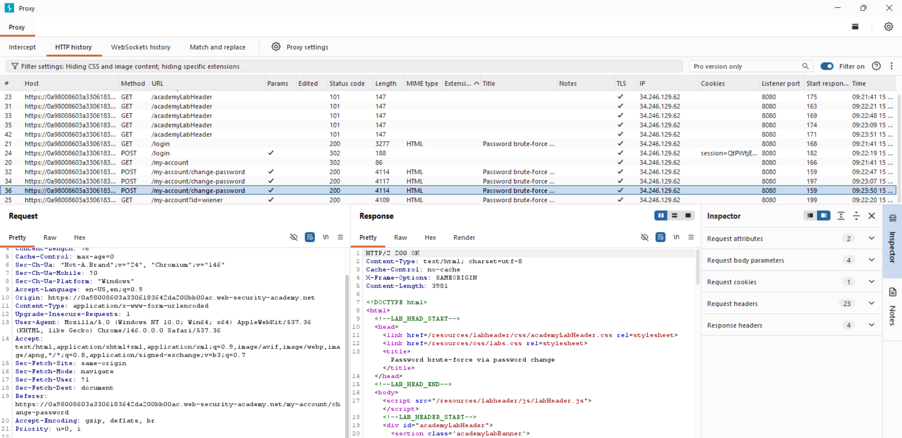
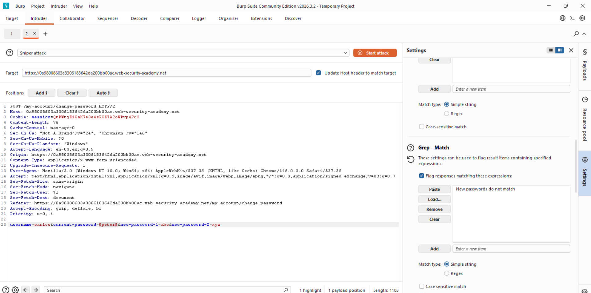
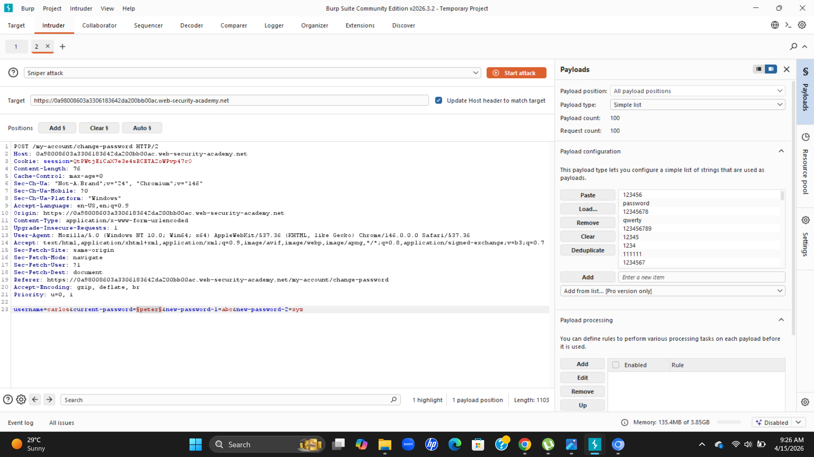
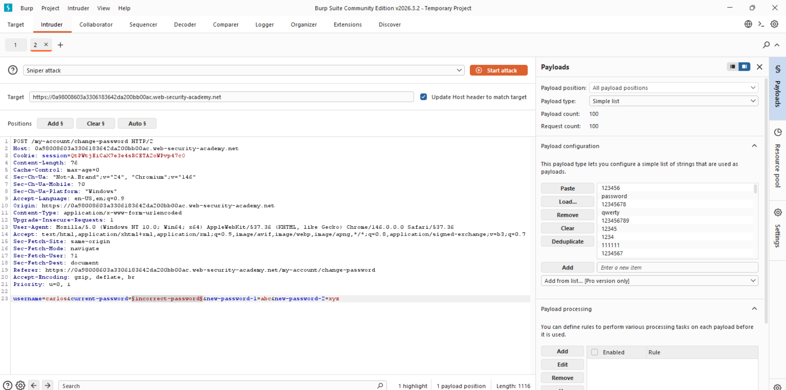
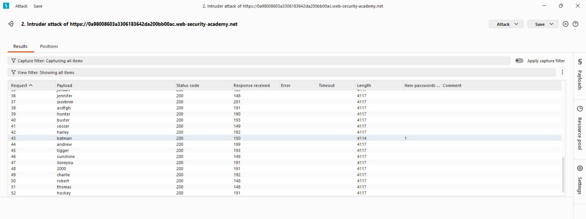
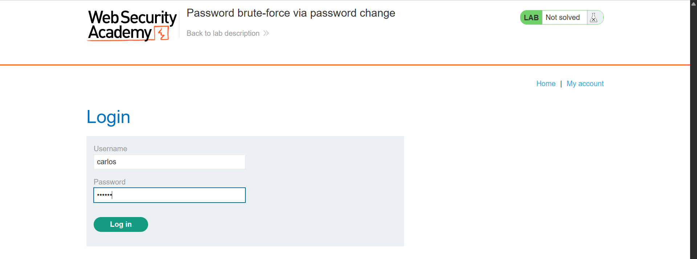

# Lab Writeup: Password Brute-Force via Password Change

> **Platform:** PortSwigger Web Security Academy  
> **Category:** Authentication  
> **Difficulty:** Practitioner  
> **Status:** ✅ Solved  
> **Date:** April 2026  

---

## Overview

This lab demonstrates a logic flaw in the password change functionality. When a valid username is supplied with a wrong current password and two non-matching new passwords, the application returns an error message that is distinct from the invalid username case — allowing username-based brute forcing. Furthermore, the password change endpoint lacks rate limiting, enabling unlimited brute-force of the current password.

**Objective:** Use the password change functionality to brute-force Carlos's current password and access his account.



---

## Vulnerability Description

| Attribute | Detail |
|-----------|--------|
| **Vulnerability Type** | Brute-Force via Password Change Logic Flaw |
| **OWASP Category** | A07:2021 – Identification and Authentication Failures |
| **Root Cause** | Password change endpoint returns different responses based on username validity; no rate limiting |
| **Bypass Technique** | Submit mismatched new passwords to trigger a specific error; brute-force current password field |
| **Impact** | Full account takeover without triggering login brute-force protections |

---

## Tools Used

- **Burp Suite Intruder** – Automated brute force of the current password field
- **Browser** – PortSwigger lab environment

---

## Exploitation Steps

### Step 1 — Log In with Own Credentials

Log in as `wiener` using credentials `wiener:peter` to access the password change functionality.


---

### Step 2 — Navigate to Password Change

Go to **My Account** and find the **Change Password** form. It requires:
- Current password
- New password
- Confirm new password



---

### Step 3 — Observe Response Differences

Test the form behavior with Carlos's username:
- Correct username + wrong current password + **matching** new passwords → `"Current password is incorrect"`
- Correct username + wrong current password + **non-matching** new passwords → `"New passwords do not match"`
- Wrong username → different response

The key insight: when new passwords **don't match**, a different error reveals whether the username is valid. Use non-matching new passwords to isolate the current password brute-force.



---

### Step 4 — Capture the Password Change Request

Submit the change password form and intercept in Burp. Send to **Intruder**. The POST body looks like:

```
username=carlos&current-password=§test§&new-password-1=anything&new-password-2=different
```

Set payload position on `current-password`.



---

### Step 5 — Configure the Payload

Load the candidate passwords wordlist as a Simple List. The username is set to `carlos` and the new passwords are intentionally mismatched to force consistent error responses.



---

### Step 6 — Run the Attack

Run the Sniper attack. Monitor for a response that differs from `"New passwords do not match"` — when the correct current password is found, the application will respond differently (e.g. redirect or `"Current password is incorrect"` disappears).



---

### Step 7 — Identify the Correct Password

Filter results by response length or content. The anomalous response identifies Carlos's current password.



---

### Step 8 — Log In as Carlos

Log out of wiener's account. Log in using `carlos` and the discovered password.



---

### Step 9 — Access Carlos's Account Page

Navigate to the account page to confirm full access.



---

### Step 10 — Lab Solved

Lab is marked as solved.



---

## Root Cause Analysis

```
Password change form reveals information through response differences:

Wrong username:                         → Generic error
Valid username + wrong current pass     → "Current password is incorrect"
Valid username + wrong current pass     
  + mismatched new passwords            → "New passwords do not match"

No rate limiting on this endpoint → unlimited brute-force attempts
Login endpoint protection is bypassed entirely — never touches /login
```

---

## Remediation

| Recommendation | Description |
|----------------|-------------|
| **Rate limit password change endpoint** | Apply the same brute-force protections to `/change-password` as to `/login` |
| **Generic error messages** | Return the same error regardless of which field is wrong |
| **Require current password verification server-side** | Validate current password before checking new password matching |
| **Log and alert on repeated password change failures** | Flag accounts with multiple failed change attempts |
| **Session re-authentication** | For sensitive operations like password change, require fresh authentication |

---

## Key Takeaways

- **Security controls on `/login` don't protect other authentication endpoints.** Attackers always look for alternative paths that bypass primary protections.
- **Error message differences are information leaks** — even in non-login forms like password change.
- **Intentionally mismatching new passwords** is a clever trick to create a stable, distinguishable response during brute force.
- **Every authentication-related endpoint** — login, password change, password reset, 2FA — needs independent rate limiting and brute-force protection.

---

*Writeup produced as part of PortSwigger Web Security Academy lab practice.*
