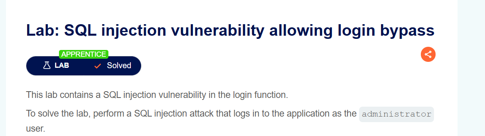
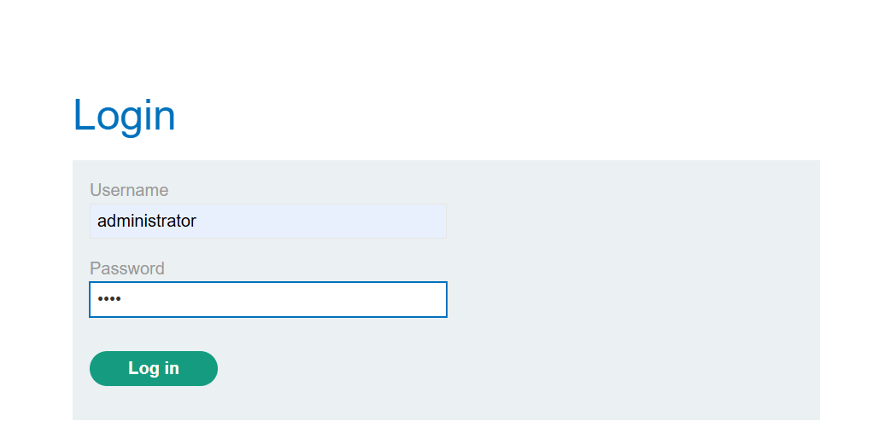
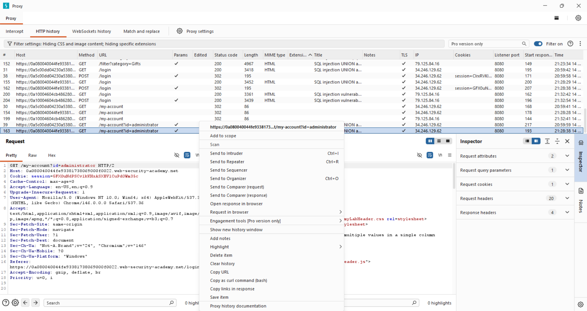
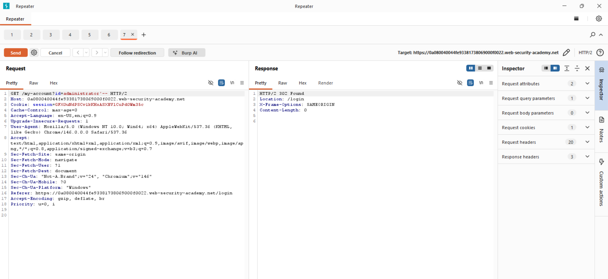
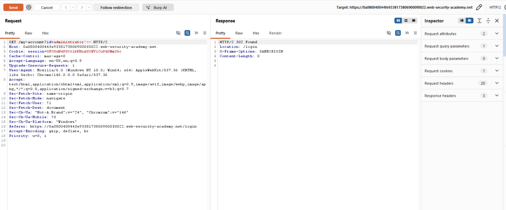

# Lab Writeup: SQL Injection Vulnerability Allowing Login Bypass

> **Platform:** PortSwigger Web Security Academy  
> **Category:** SQL Injection  
> **Difficulty:** Apprentice  
> **Status:** ✅ Solved  
> **Date:** April 2026  

---

## Overview

This lab demonstrates a SQL injection vulnerability in the login function. By injecting into the username field, the authentication logic can be completely bypassed — allowing login as any user without knowing their password.

**Objective:** Log in to the application as the `administrator` user using SQL injection.



---

## Vulnerability Description

| Attribute | Detail |
|-----------|--------|
| **Vulnerability Type** | SQL Injection — Authentication Bypass |
| **OWASP Category** | A03:2021 – Injection / A07:2021 – Identification & Authentication Failures |
| **Injection Point** | Username field in the login form |
| **Root Cause** | Username concatenated directly into SQL query without sanitization |
| **Impact** | Complete authentication bypass — login as any user |

The application likely runs a query like:

```sql
SELECT * FROM users WHERE username = 'input' AND password = 'input'
```

By injecting into the username field, the password check can be completely removed.

---

## Tools Used

- **Browser** – Login form manipulation

---

## Exploitation Steps

### Step 1 — Navigate to the Login Page

Access the application login page.



---

### Step 2 — Inject into the Username Field

Enter the following in the **username** field:

```
administrator'--
```

Leave the **password** field blank or enter anything.

**How it works:**
- `administrator` — targets the admin account
- `'` — closes the string in the SQL query
- `--` — comments out the rest of the query, including `AND password = '...'`

The resulting query becomes:

```sql
SELECT * FROM users WHERE username = 'administrator'--' AND password = ''
```

The password check is completely commented out.



---

### Step 3 — Submit and Gain Access

Submit the form. The server processes the manipulated query and returns the administrator's account row — granting full access.



---

### Step 4 — Lab Solved

Successfully logged in as administrator without knowing the password. Lab is marked as solved.



---

## Root Cause Analysis

```
Username input:  administrator'--
                        │
                        ▼
SQL Query:  SELECT * FROM users 
            WHERE username = 'administrator'--' AND password = ''
                                              ↑
                                   Everything after -- is ignored
                                   Password check bypassed entirely
```

---

## Remediation

| Recommendation | Description |
|----------------|-------------|
| **Parameterized Queries** | Use prepared statements for all login queries — the definitive fix |
| **Never Concatenate User Input into SQL** | Treat all login field input as untrusted data |
| **Rate Limit Login Attempts** | Slow down brute force and injection attempts |
| **Multi-Factor Authentication** | Even if credentials are bypassed, MFA adds another barrier |

---

## Key Takeaways

- **Login forms are extremely high-value injection targets** — successful injection grants immediate account access without credentials.
- **`'--`** is one of the most powerful and simple injection payloads — it terminates the string and comments out all remaining conditions.
- **This attack works on any account** — replacing `administrator` with `wiener`, `carlos`, or any known username bypasses their login too.
- **Parameterized queries make this attack impossible** — the `'--` is treated as a literal string, not SQL syntax.

---

*Writeup produced as part of PortSwigger Web Security Academy lab practice.*
