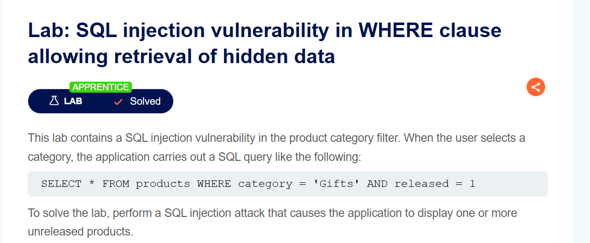
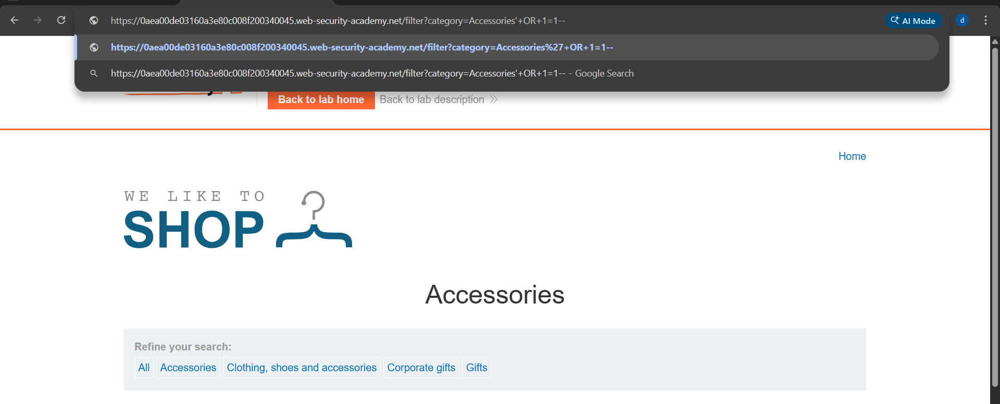
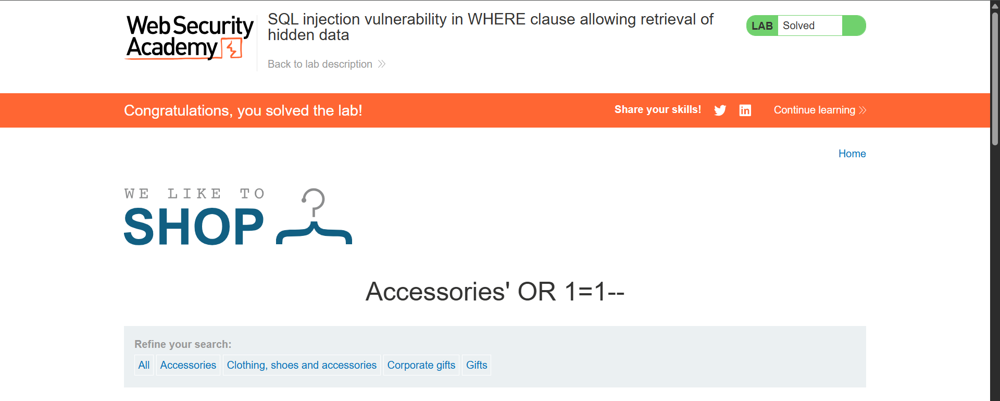

# Lab Writeup: SQL Injection Vulnerability in WHERE Clause Allowing Retrieval of Hidden Data

> **Platform:** PortSwigger Web Security Academy  
> **Category:** SQL Injection  
> **Difficulty:** Apprentice  
> **Status:** ✅ Solved  
> **Date:** April 2026  

---

## Overview

This lab demonstrates a classic SQL injection vulnerability in a product category filter. The application builds a SQL query using unvalidated user input, allowing an attacker to manipulate the query logic and retrieve hidden (unreleased) products.

**Objective:** Perform a SQL injection attack that causes the application to display one or more unreleased products.



---

## Vulnerability Description

| Attribute | Detail |
|-----------|--------|
| **Vulnerability Type** | SQL Injection — WHERE clause manipulation |
| **OWASP Category** | A03:2021 – Injection |
| **Injection Point** | `category` query parameter in the product filter |
| **Root Cause** | User input concatenated directly into SQL query without sanitization |
| **Impact** | Retrieval of hidden/unreleased data from the database |

The application executes a query like:

```sql
SELECT * FROM products WHERE category = 'Gifts' AND released = 1
```

By injecting into the `category` parameter, an attacker can modify the logic to bypass the `released = 1` filter.

---

## Tools Used

- **Browser** – URL manipulation to deliver payload

---

## Exploitation Steps

### Step 1 — Identify the Injection Point

Navigate to the shop and select any product category. Observe the URL:

```
/filter?category=Gifts
```

The `category` parameter is passed directly into the SQL query.

---

### Step 2 — Inject the Payload

Modify the URL to inject the following payload:

```
/filter?category=Accessories'+OR+1=1--
```

**How it works:**
- `'` closes the string in the SQL query
- `OR 1=1` makes the condition always true
- `--` comments out the rest of the query including `AND released = 1`

The resulting query becomes:
```sql
SELECT * FROM products WHERE category = 'Accessories' OR 1=1--' AND released = 1
```

All products including unreleased ones are returned.



---

### Step 3 — Lab Solved

The page now displays all products including hidden/unreleased ones. The lab is marked as solved.



---

## Root Cause Analysis

```
User input:  Accessories' OR 1=1--
                    │
                    ▼
SQL Query:  SELECT * FROM products 
            WHERE category = 'Accessories' OR 1=1--' AND released = 1
                                              ↑
                                    Always TRUE — returns ALL rows
```

The application concatenates user input directly into the SQL string with no parameterization or escaping, allowing full control over the query logic.

---

## Remediation

| Recommendation | Description |
|----------------|-------------|
| **Use Parameterized Queries** | Always use prepared statements with bound parameters — the primary fix for SQL injection |
| **Input Validation** | Whitelist expected values for category filters |
| **Least Privilege** | Database accounts should only have SELECT access where needed — not INSERT/UPDATE/DELETE |
| **WAF** | A Web Application Firewall can detect and block common SQLi patterns as defence-in-depth |

---

## Key Takeaways

- **SQL injection is the #1 most critical web vulnerability.** It allows direct manipulation of database queries.
- **`OR 1=1`** is a classic technique that makes any WHERE condition always evaluate to true.
- **`--`** is the SQL comment syntax used to strip off the rest of the original query.
- **Parameterized queries completely prevent this attack** regardless of what input the user supplies.

---

*Writeup produced as part of PortSwigger Web Security Academy lab practice.*
