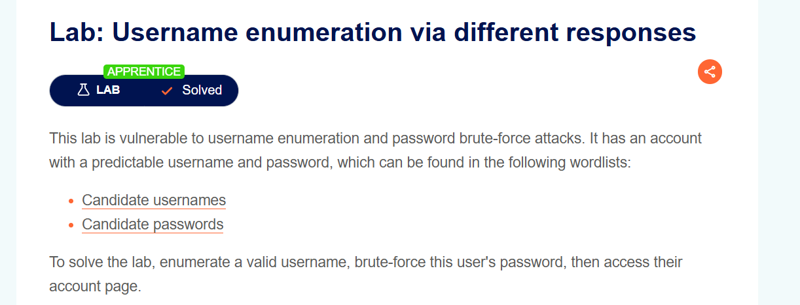
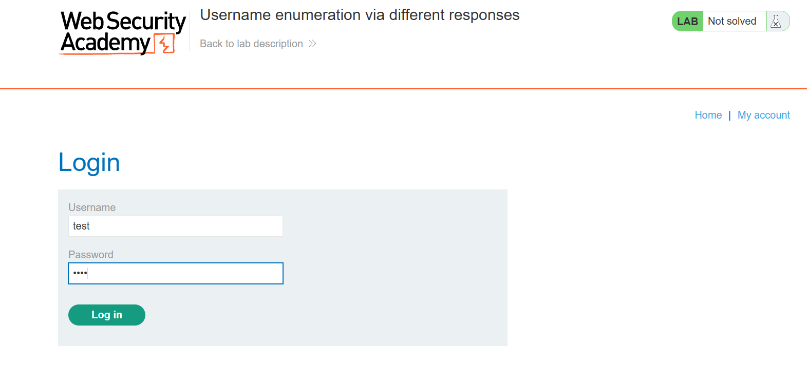
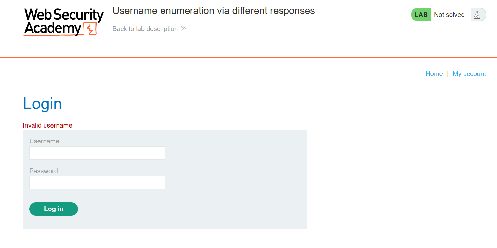
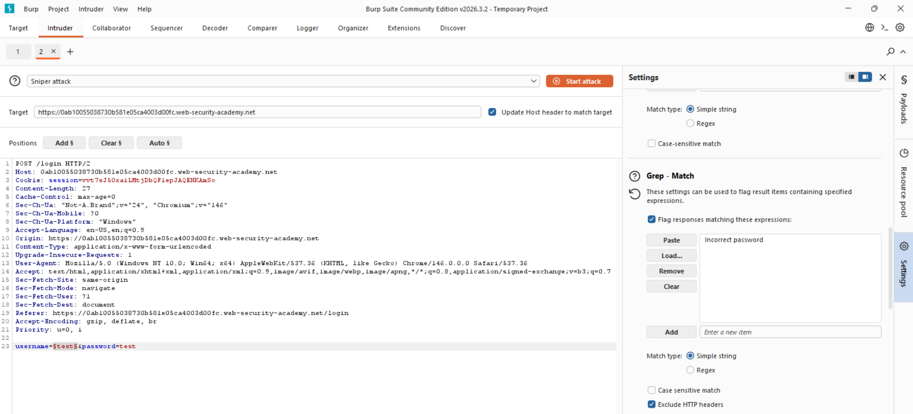
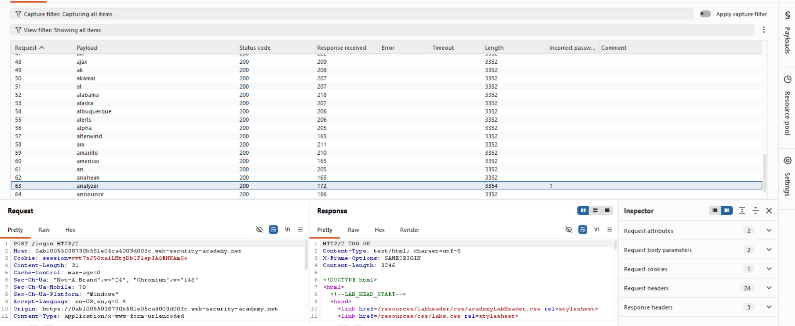
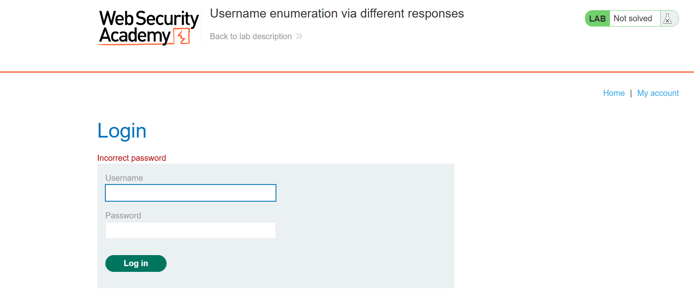
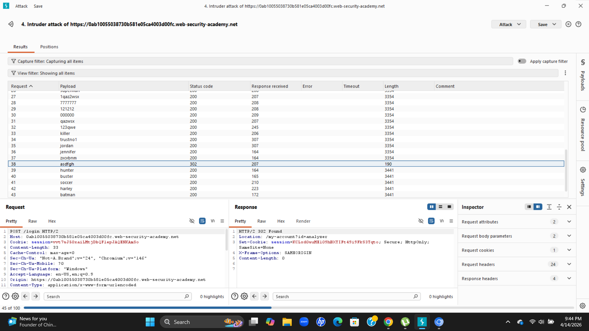
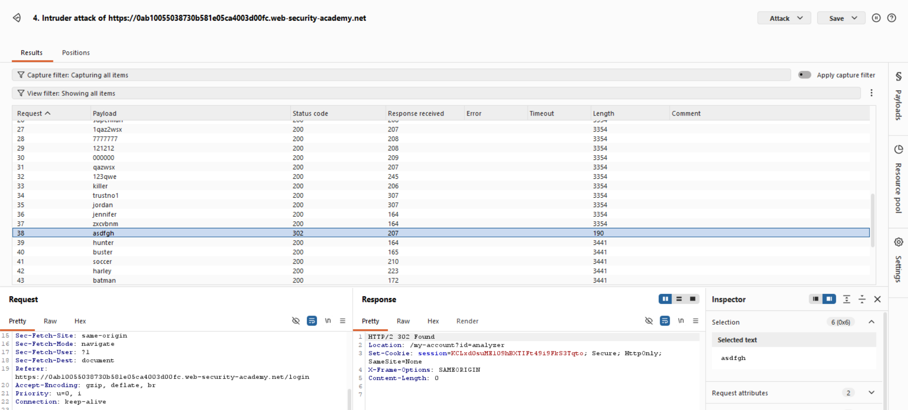
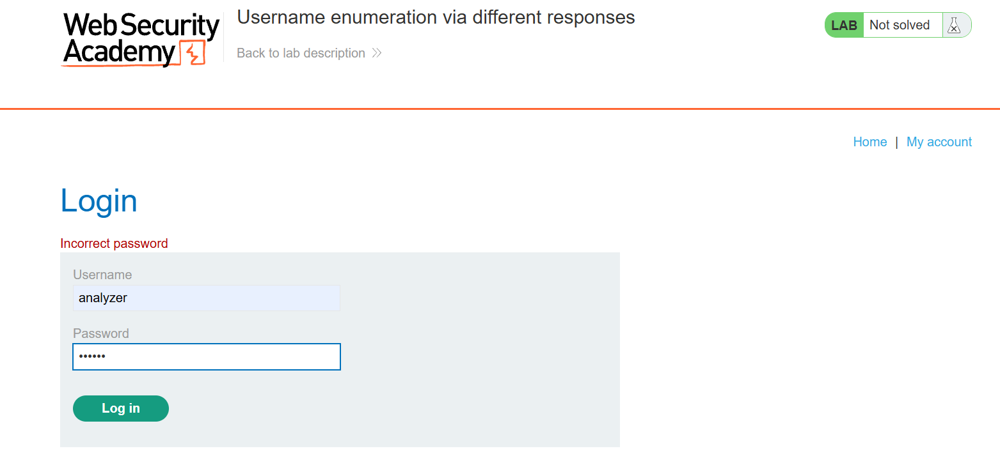

# Lab Writeup: Username Enumeration via Different Responses

> **Platform:** PortSwigger Web Security Academy  
> **Category:** Authentication  
> **Difficulty:** Apprentice  
> **Status:** ✅ Solved  
> **Date:** April 2026  

---

## Overview

This lab demonstrates a username enumeration vulnerability where the application returns subtly different error messages depending on whether a username is valid. By automating login attempts with a wordlist, valid usernames can be identified, then the password can be brute-forced to gain access.

**Objective:** Enumerate a valid username, brute-force the password, then access the victim's account page.



---

## Vulnerability Description

| Attribute | Detail |
|-----------|--------|
| **Vulnerability Type** | Username Enumeration + Password Brute Force |
| **OWASP Category** | A07:2021 – Identification and Authentication Failures |
| **Injection Point** | Login form — username and password fields |
| **Root Cause** | Different error messages reveal whether a username exists |
| **Impact** | Account takeover via enumeration and brute force |

**The difference:**
- Invalid username → `"Invalid username"`
- Valid username, wrong password → `"Incorrect password"`

This subtle difference allows an attacker to identify valid usernames before brute-forcing passwords.

---

## Tools Used

- **Burp Suite Intruder** – Automated username enumeration and password brute force
- **Browser** – PortSwigger lab environment

---

## Exploitation Steps

### Step 1 — Capture the Login Request

Submit any login attempt and capture it in Burp Proxy. Send it to **Intruder**.



---

### Step 2 — Configure Intruder for Username Enumeration

Set the payload position on the **username** field only. Load the candidate usernames wordlist from PortSwigger as a Simple List payload.



---

### Step 3 — Run the Attack and Identify Valid Username

Run the Sniper attack. Filter results by **response length** — a different length indicates a different error message.

The response containing `"Incorrect password"` (instead of `"Invalid username"`) identifies the valid username.



---

### Step 4 — Configure Intruder for Password Brute Force

Reset the payload position to the **password** field. Enter the identified valid username. Load the candidate passwords wordlist.



---

### Step 5 — Run the Password Attack

Run the attack. Filter by response length or status code — a `302 Found` redirect indicates a successful login.



---

### Step 6 — Log In with Discovered Credentials

Use the discovered username and password to log in via the browser.



---

### Step 7 — Access the Account Page

Navigate to the account page to confirm access.



---

### Step 8 — Lab Solved

Lab is marked as solved.



---

## Root Cause Analysis

```
Attack Phase 1 — Username Enumeration:
  POST /login  username=invalid → "Invalid username"      ← user does NOT exist
  POST /login  username=carlos  → "Incorrect password"    ← user EXISTS ✓

Attack Phase 2 — Password Brute Force:
  POST /login  username=carlos&password=abc123   → 200 (wrong)
  POST /login  username=carlos&password=p4ssw0rd → 302 (correct!) ✓
```

---

## Remediation

| Recommendation | Description |
|----------------|-------------|
| **Generic Error Messages** | Always return the same message: `"Invalid username or password"` — never reveal which part was wrong |
| **Account Lockout** | Lock accounts after N failed attempts to prevent brute force |
| **Rate Limiting** | Limit login attempts per IP per time window |
| **CAPTCHA** | Add CAPTCHA after several failed attempts to block automated tools |
| **Multi-Factor Authentication** | Even with correct credentials, MFA stops unauthorized access |

---

## Key Takeaways

- **Subtle differences in error messages leak critical information.** Even a single different word (`"Invalid username"` vs `"Incorrect password"`) is enough to enumerate valid accounts.
- **Username enumeration is always the first step** in a targeted brute-force attack — it narrows down the attack surface.
- **Burp Intruder automates the entire process** — what would take hours manually takes minutes with automation.
- **Generic error messages are a simple, free fix** that significantly raises the cost of this attack.

---

*Writeup produced as part of PortSwigger Web Security Academy lab practice.*
